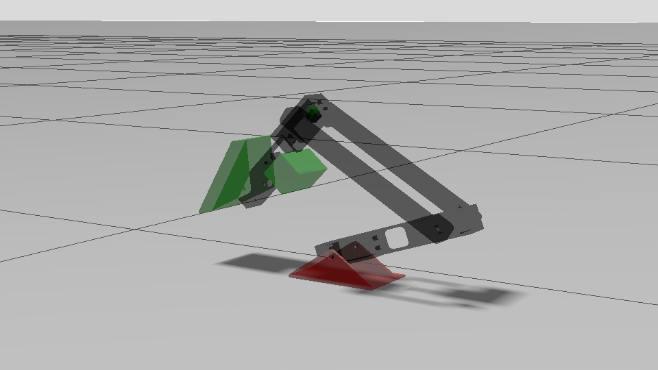

# kumi_stack



ROS 2 workspace for the `kumi` robot, including robot description, control, Gazebo simulation, and full bringup.

## Contents

- [Package Overview](#package-overview)
- [Installation](#installation)
- [Build](#build)
- [Launch](#launch)
- [Controller](#controller)
- [Sensors](#sensors)
- [Useful Commands](#useful-commands)

## Package Overview

### `kumi_description`

Contains the robot model and all related resources:
- URDF / Xacro
- meshes
- sensors
- Gazebo / ros2_control plugins

Current Xacro structure:
- [kumi.xacro](/home/andreas/dev_ws/kumi_stack/src/kumi_description/urdf/kumi.xacro)
- [macros.xacro](/home/andreas/dev_ws/kumi_stack/src/kumi_description/urdf/macros.xacro)
- [core.xacro](/home/andreas/dev_ws/kumi_stack/src/kumi_description/urdf/core.xacro)
- [sensors.xacro](/home/andreas/dev_ws/kumi_stack/src/kumi_description/urdf/sensors.xacro)
- [gazebo_plugins.xacro](/home/andreas/dev_ws/kumi_stack/src/kumi_description/urdf/gazebo_plugins.xacro)

### `kumi_control`

Handles the control layer:
- controller configuration
- controller manager launch
- Python nodes that publish joint trajectories

Configured controllers:
- `joint_state_broadcaster`
- `multi_joint_trajectory_controller`

### `kumi_sim`

Provides simulation support:
- Gazebo launch
- world files
- Gazebo resources

Available worlds:
- `my_empty`
- `stairs`

### `kumi_bringup`

Bringup package for launching the full simulation stack:
- Gazebo
- robot description
- robot spawning
- controllers
- Gazebo/ROS bridge for clock and camera topics

### `kumi_perception`

Placeholder package for perception. At the moment it is minimal inside this workspace.

## Installation

### Requirements

- Ubuntu 24.04
- ROS 2 Jazzy
- Gazebo Harmonic

Official guides:
- [ROS 2 Jazzy installation guide](https://docs.ros.org/en/jazzy/Installation/Ubuntu-Install-Debs.html)
- [Gazebo Harmonic installation guide](https://gazebosim.org/docs/harmonic/install_ubuntu/)

### Clone

```bash
git clone <repo-url> ~/dev_ws/kumi_stack
```

### Full workspace installation

Inside [kumi_stack](/home/andreas/dev_ws/kumi_stack):

```bash
./scripts/kumi_install.sh
```

The script:
- installs system dependencies
- initializes `rosdep`
- creates the [`.venv`](/home/andreas/dev_ws/kumi_stack/.venv) virtual environment
- installs Python dependencies
- runs `colcon build --symlink-install`

## Build

Every time you open a new terminal:

```bash
cd /home/andreas/dev_ws/kumi_stack
source /opt/ros/jazzy/setup.bash
source .venv/bin/activate
source install/setup.bash
```

If you change code:

```bash
colcon build --symlink-install
source install/setup.bash
```

## Launch

### Full simulation stack

```bash
ros2 launch kumi_bringup sim_bringup.launch.py
```

Useful parameters:
- `world:=my_empty`
- `world:=stairs`
- `enable_sensors:=true`
- `use_rviz:=false`
- `use_joint_state_publisher_gui:=false`
- `ros_namespace:=kumi`
- `robot_name:=bruno`

Example:

```bash
ros2 launch kumi_bringup sim_bringup.launch.py world:=my_empty enable_sensors:=true
```

### Robot description only

```bash
ros2 launch kumi_description description.launch.py use_rviz:=false use_joint_state_publisher_gui:=false
```

### Gazebo only

```bash
ros2 launch kumi_sim sim.launch.py world:=my_empty
```

### Control only

```bash
ros2 launch kumi_control control.launch.py
```

## Controller

The active trajectory controller is `multi_joint_trajectory_controller`.

Configuration:
- [trajectory_control_config.yaml](/home/andreas/dev_ws/kumi_stack/src/kumi_control/config/trajectory_control_config.yaml)

Controller topic:
- `/kumi/multi_joint_trajectory_controller/joint_trajectory`

Demo node that publishes trajectories from CSV:

```bash
ros2 run kumi_control kumi_seq_traj_controller
```

Default CSV:
- [demo_flip_500.csv](/home/andreas/dev_ws/kumi_stack/src/kumi_control/resource/demo_flip_500.csv)

## Sensors

The robot currently exposes:
- front RGB camera
- front depth camera

Gazebo topics bridged to ROS:
- `/front_camera/image`
- `/front_camera/camera_info`
- `/front_depth/image`
- `/front_depth/camera_info`

You can disable sensors with:

```bash
ros2 launch kumi_bringup sim_bringup.launch.py enable_sensors:=false
```

## Useful Commands

List controllers:

```bash
ros2 control list_controllers
```

Check the trajectory topic:

```bash
ros2 topic echo /kumi/multi_joint_trajectory_controller/joint_trajectory
```

Kill Gazebo:

```bash
pkill -9 -f 'gz-sim|gz sim|gz'
```

Build a single package:

```bash
colcon build --packages-select kumi_description --symlink-install
```
