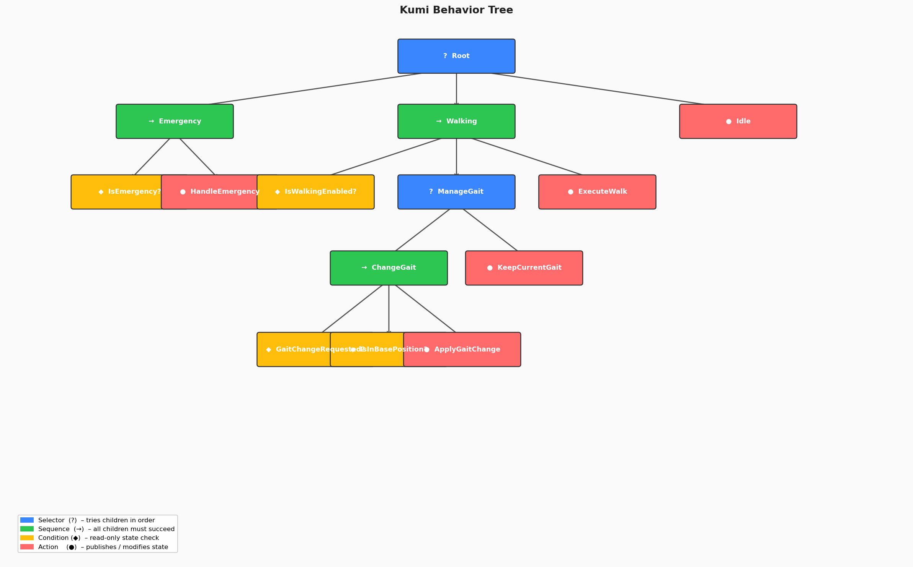
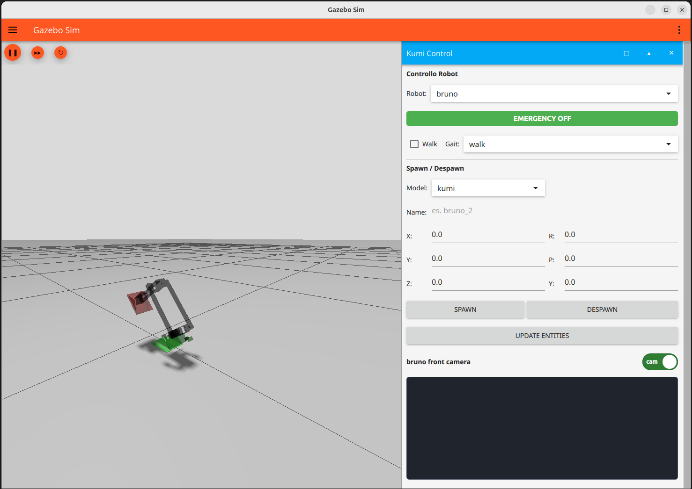

# kumi_stack


ROS 2 workspace for the `kumi` robot, including robot description, control, Gazebo simulation, behavior tree, and full bringup.

## Contents

- [Package Overview](#package-overview)
- [Behavior Tree](#behavior-tree)
- [Installation](#installation)
- [Build](#build)
- [Launch](#launch)
- [Movement Modes](#movement-modes)
- [Sensors](#sensors)
- [Gazebo Interface](#gazebo-interface)
- [Useful Commands](#useful-commands)

---

## Package Overview

### `kumi_description`

Contains the robot model and all related resources:
- URDF / Xacro
- meshes
- sensors
- Gazebo / ros2_control plugins

Xacro structure:
- [kumi.xacro](src/kumi_description/urdf/kumi.xacro)
- [macros.xacro](src/kumi_description/urdf/macros.xacro)
- [core.xacro](src/kumi_description/urdf/core.xacro)
- [sensors.xacro](src/kumi_description/urdf/sensors.xacro)
- [gazebo_plugins.xacro](src/kumi_description/urdf/gazebo_plugins.xacro)

### `kumi_control`

Handles the control layer:
- controller configuration and manager launch
- `kumi_seq_traj_controller` — Python node that reads joint trajectories from CSV files and publishes them to the active controller; supports both Gazebo (`JointTrajectory`) and Isaac Sim (`JointState`)
- `kumi_control_gui` — lightweight Tkinter interface to manage the robot's movement mode, emergency state, and active gait

Configured controllers:
- `joint_state_broadcaster`
- `multi_joint_trajectory_controller`

### `kumi_sim`

Provides simulation support:
- Gazebo launch files
- world SDF files
- Gazebo resources and robot-spawning utilities

Available worlds:
- `my_empty`
- `stairs`

### `kumi_bringup`

Top-level bringup package for launching the full simulation stack:
- Gazebo world
- robot description and spawning
- controllers
- Gazebo/ROS bridge for clock and camera topics

### `kumi_behavior`

Implements the robot's decision logic as a **py_trees behavior tree** (see [Behavior Tree](#behavior-tree)):
- `bt_node.py` — ROS 2 node that owns the tree, subscribes to state topics, and ticks the tree at 10 Hz
- `tree.py` — tree factory function
- `behaviors/` — individual condition and action nodes

### `my_gz_gui_plugin`

A custom C++/QML plugin that is embedded directly in the Gazebo GUI sidebar. It acts as the main in-simulation operator interface, providing robot selection, emergency control, walk/gait commands, spawn/despawn tools, and a live front-camera preview. Built with `gz-gui8` and `gz-transport13`.

### `kumi_perception`

Placeholder package for perception. Minimal at the moment.

---

## Behavior Tree

The behavior tree governs the robot's high-level logic. It is ticked at 10 Hz by the `bt_node` ROS 2 node and evaluates three branches in priority order via a **root Selector**. For a general introduction to behavior trees see [behaviortree.dev](https://www.behaviortree.dev/docs/intro) and the [py_trees documentation](https://py-trees.readthedocs.io/en/devel/).



```
Root (Selector)
├── Emergency (Sequence)          ← highest priority
│   ├── IsEmergency?
│   └── HandleEmergency           (publishes walk_enabled = false)
├── Walking (Sequence)
│   ├── IsWalkingEnabled?
│   ├── ManageGait (Selector)
│   │   ├── ChangeGait (Sequence)
│   │   │   ├── GaitChangeRequested?
│   │   │   ├── IsInBasePosition?
│   │   │   └── ApplyGaitChange   (swaps CSV, publishes new gait)
│   │   └── KeepCurrentGait       (no-op, always SUCCESS)
│   └── ExecuteWalk               (enables the trajectory controller)
└── Idle                          ← fallback, always RUNNING
```

**How it works:**

1. If an emergency is active, `HandleEmergency` immediately disables the trajectory publisher, regardless of any other state.
2. If walking is enabled, `ManageGait` checks whether a new gait has been requested. A gait change is only applied once the robot is back in its base position (`IsInBasePosition`), avoiding mid-step transitions. If no change is needed, `KeepCurrentGait` succeeds and the tree proceeds to `ExecuteWalk`.
3. If neither branch succeeds the robot falls through to `Idle`, which keeps the tree alive without publishing anything.

State is fed into the tree via ROS 2 subscriptions on the `bt_node`:

| Topic | Type | Description |
|---|---|---|
| `kumi_behavior/emergency` | `std_msgs/Bool` | emergency flag |
| `kumi_seq_traj_controller/enabled` | `std_msgs/Bool` | walk enable/disable feedback |
| `kumi_seq_traj_controller/gait` | `std_msgs/String` | requested gait name |

---

## Installation

### Requirements

- Docker (with Compose)
- VSCode with the [Dev Containers](https://marketplace.visualstudio.com/items?itemName=ms-vscode-remote.remote-containers) extension *(recommended)*

### Clone

```bash
git clone <repo-url> ~/dev_ws/kumi_stack
```

### Open the development container

The workspace runs inside a Docker container defined in [.devcontainer/](.devcontainer/).  
Choose one of the two methods below.

#### From terminal

```bash
cd ~/dev_ws/kumi_stack

# allow the container to use the host display
xhost +local:docker

# start the container
docker compose -f .devcontainer/docker-compose.yml up -d

# attach a shell
docker exec -it kumi_stack-kumi-1 bash
```

Inside the container the first-run bootstrap script runs automatically (`setup.sh`), which installs system dependencies, creates the `.venv`, and builds the workspace. On subsequent runs the existing `install/` is reused.

To source the workspace in any new shell inside the container:

```bash
source /opt/ros/jazzy/setup.bash
source /workspaces/kumi_stack/.venv/bin/activate
source /workspaces/kumi_stack/install/setup.bash
```

#### From VSCode with Dev Containers extension

1. Install the **Dev Containers** extension (`ms-vscode-remote.remote-containers`).
2. Open the `kumi_stack` folder in VSCode.
3. When the notification appears, click **Reopen in Container** — or open the Command Palette (`Ctrl+Shift+P`) and run **Dev Containers: Reopen in Container**.

VSCode builds the image on the first run and then attaches to the container with all extensions, Python paths, and ROS settings pre-configured. Subsequent opens skip the build step and reuse the existing container.

---

## Build

Every time you open a new terminal inside the container:

```bash
source /opt/ros/jazzy/setup.bash
source .venv/bin/activate
source install/setup.bash
```

After changing code:

```bash
colcon build --symlink-install
source install/setup.bash
```

Build a single package:

```bash
colcon build --packages-select kumi_behavior --symlink-install
```

---

## Launch

### Full simulation stack

```bash
ros2 launch kumi_bringup sim_bringup.launch.py
```

Available parameters:

| Parameter | Default | Description |
|---|---|---|
| `world` | `my_empty` | World name (`my_empty`, `stairs`) |
| `robot_name` | `bruno` | Name of the spawned robot |
| `ros_namespace` | `bruno` | ROS namespace for controllers and nodes |
| `robot_xacro` | `kumi.xacro` | Xacro file to use |
| `enable_sensors` | `true` | Enable front camera and depth sensor |
| `use_rviz` | `false` | Launch RViz |
| `use_joint_state_publisher_gui` | `false` | Launch joint state publisher GUI |
| `use_control_gui` | `false` | Launch the `kumi_control_gui` window |
| `spawn_delay` | `8.0` | Seconds to wait before spawning the robot |
| `spawner_delay` | `10.0` | Seconds to wait before activating controllers |

Example:

```bash
ros2 launch kumi_bringup sim_bringup.launch.py world:=my_empty enable_sensors:=true use_control_gui:=true
```

---

## Movement Modes

Kumi supports two movement modes that are selected via the [control GUI](#control-interface).

### Manual mode

In manual mode the robot walks continuously in a loop using a repeating step trajectory. Movement is controlled via keyboard:

- **Forward / backward** — step in the selected direction
- **Turning** — the robot can rotate at each step; the turning angle is configurable and adjustable at runtime via the control interface

This mode uses the `walk` (forward) and `bwalk` (backward) gaits, both executed in loop.

### Gait mode

In gait mode the robot executes a single predefined movement sequence. Available gaits:

| Gait | Direction | Type |
|---|---|---|
| `flip` | forward | single flip |
| `flip_sx` | forward-left | single flip |
| `flip_dx` | forward-right | single flip |
| `bflip` | backward | single backflip |
| `bflip_sx` | backward-left | single backflip |
| `bflip_dx` | backward-right | single backflip |

The six directional gaits form a grid similar to chess piece movement: forward/backward along the axis, or diagonally left/right. Each gait plays once and then the controller stops, returning the robot to its base position ready for the next command.

### Control interface

A small control window manages the active mode and displays the current state:

```bash
ros2 run kumi_control kumi_control_gui
```

Or launch it together with the simulation using `use_control_gui:=true`.

The interface shows:
- **Emergency** toggle — immediately stops all motion
- **Walk enabled** checkbox — activates or deactivates the trajectory publisher
- **Gait** selector — switches the active gait (mode); the turning angle for manual walking is also reflected here

---

## Sensors

The robot currently exposes:
- front RGB camera
- front depth camera

Gazebo topics bridged to ROS:
- `/front_camera/image`
- `/front_camera/camera_info`
- `/front_depth/image`
- `/front_depth/camera_info`

Disable sensors at launch:

```bash
ros2 launch kumi_bringup sim_bringup.launch.py enable_sensors:=false
```

---

## Gazebo Interface

When you launch the full simulation, Gazebo loads the custom `my_gz_gui_plugin` panel directly inside the GUI. The panel is docked in the Gazebo sidebar and acts as the main operator interface for spawned robots.



Main GUI features:
- `Robot` selector to choose which spawned robot the panel is controlling
- `EMERGENCY ON/OFF` toggle to publish the emergency state for the selected robot
- `Walk` checkbox to enable or disable walking commands
- `Gait` dropdown to switch the active gait
- `Spawn / Despawn` tools to create or remove models from the current world
- `update entities` button to refresh the robot and model lists
- front camera preview for the selected robot, with a toggle to show or hide the panel

How it works:
- the GUI discovers robots in the Gazebo world and updates its dropdowns automatically
- when a robot is selected, the plugin publishes commands on Gazebo transport topics derived from that robot name
- the camera panel subscribes to `/<robot_name>/front_camera/image` and shows the live image when sensors are enabled
- spawn and remove actions use the world transport services configured in the world SDF

Typical workflow:
1. Launch the simulation: `ros2 launch kumi_bringup sim_bringup.launch.py`
2. Wait for Gazebo to open and for the `Kumi Control` panel to appear.
3. Select a robot in the `Robot` dropdown.
4. Use `EMERGENCY`, `Walk`, and `Gait` to control the robot.
5. Use the lower section to spawn additional entities or remove existing ones.
6. Open the camera preview to monitor the front camera.

Notes:
- the GUI is part of the Gazebo world configuration and appears automatically in worlds that include the plugin
- the front camera preview only works when the robot is launched with `enable_sensors:=true`
- if the robot list looks outdated, press `update entities`

---

## Useful Commands

List active controllers:

```bash
ros2 control list_controllers
```

Check the trajectory topic:

```bash
ros2 topic echo /bruno/multi_joint_trajectory_controller/joint_trajectory
```

Monitor behavior tree state:

```bash
ros2 topic echo /rosout  # bt_node logs tree state every second
```

Kill Gazebo:

```bash
pkill -9 -f 'gz-sim|gz sim|gz'
```
