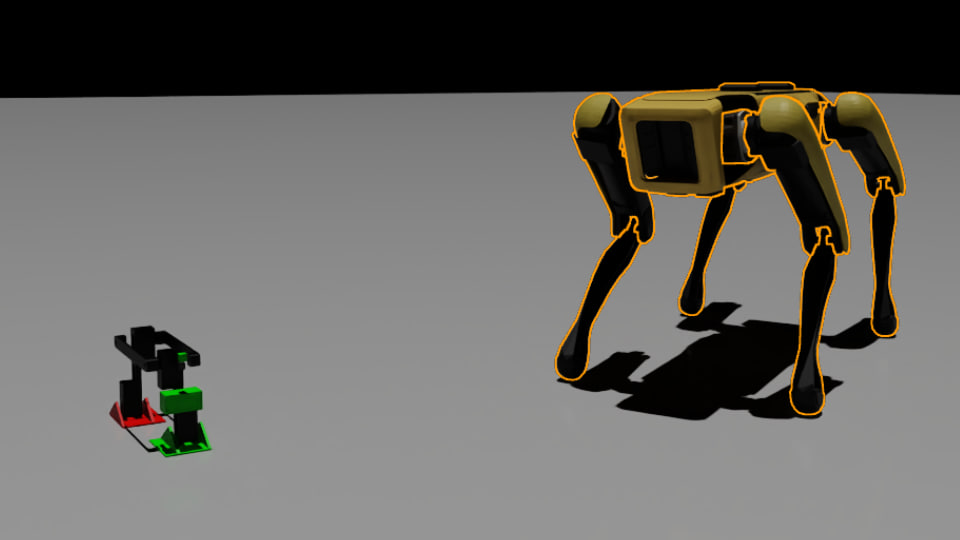
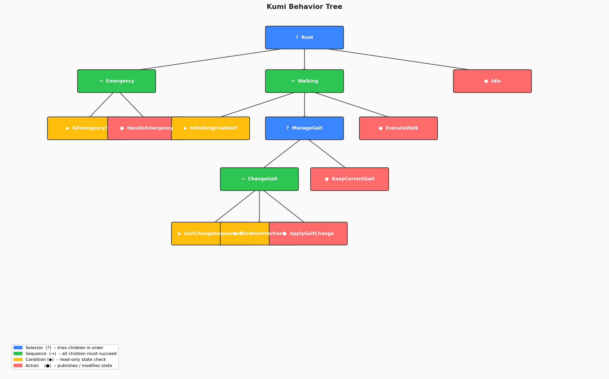
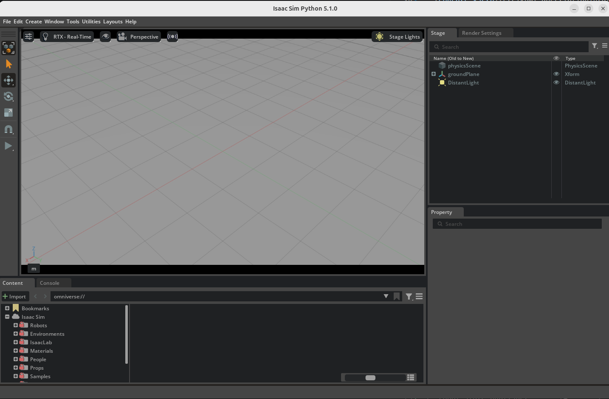

# kumi_stack




ROS 2 workspace for the `kumi` robot — robot description, controllers, behavior tree, and Isaac Sim integration.

## Contents

- [Package Overview](#package-overview)
- [Architecture](#architecture)
- [Behavior Tree](#behavior-tree)
- [Installation](#installation)
- [Build](#build)
- [Isaac Sim Integration](#isaac-sim-integration)
- [Launch](#launch)
- [Movement Modes](#movement-modes)
- [Useful Commands](#useful-commands)

---

## Package Overview

### `kumi_description`

Robot model and all related resources:
- URDF / Xacro description
- Meshes
- Camera link definitions (8 corner cameras: 4 RGB + 4 depth)

Xacro structure:
- [kumi.xacro](src/kumi_description/urdf/kumi.xacro) — main entry point
- [macros.xacro](src/kumi_description/urdf/macros.xacro) — shared macros and materials
- [core.xacro](src/kumi_description/urdf/core.xacro) — body, joints, feet
- [sensors.xacro](src/kumi_description/urdf/sensors.xacro) — camera link macros

### `kumi_control`

Control layer:
- `kumi_seq_traj_controller` — reads joint trajectories from CSV files and publishes them to Isaac Sim as `sensor_msgs/JointState` on `/kumi/joint_commands`
- `kumi_control_gui` — lightweight Tkinter interface to manage the robot's movement mode, emergency state, and active gait

### `kumi_bringup`

Top-level launch package. Entry point for the Isaac Sim workflow:
- `isaac_bringup.launch.py` — starts `robot_state_publisher`, the trajectory controller, and the control GUI

### `kumi_behavior`

Robot decision logic implemented as a **py_trees behavior tree** (see [Behavior Tree](#behavior-tree)):
- `bt_node.py` — ROS 2 node that owns the tree, subscribes to state topics, and ticks the tree at 10 Hz
- `tree.py` — tree factory
- `behaviors/` — individual condition and action nodes

### `kumi_perception`

Placeholder package for perception. Minimal at the moment.

---

## Architecture

All ROS 2 topics live under the `/kumi` namespace. The ROS 2 side of this repository is responsible for the robot description, the TF tree, and the motion commands. Isaac Sim is responsible for physics, sensors, and joint state feedback.

```
┌──────────────────────────────┐        ┌────────────────────────────┐
│   ROS 2 (this repository)    │        │       Isaac Sim container  │
│                              │        │                            │
│  robot_state_publisher       │◄───────│  /kumi/joint_states        │
│    └─ publishes /kumi/       │        │                            │
│       robot_description      │        │                            │
│    └─ publishes /tf          │        │                            │
│                              │────────►  /kumi/joint_commands      │
│  kumi_seq_traj_controller    │        │                            │
│    └─ reads CSV gaits        │        │                            │
│    └─ publishes JointState   │        │                            │
│                              │        │                            │
│  kumi_control_gui            │        │                            │
│    └─ enable / gait / e-stop │        │                            │
└──────────────────────────────┘        └────────────────────────────┘
```

| Topic | Direction | Type | Description |
|---|---|---|---|
| `/kumi/robot_description` | ROS 2 → Isaac | `std_msgs/String` | URDF string (latched) |
| `/kumi/joint_states` | Isaac → ROS 2 | `sensor_msgs/JointState` | current joint positions |
| `/kumi/joint_commands` | ROS 2 → Isaac | `sensor_msgs/JointState` | target joint positions |
| `/kumi/kumi_seq_traj_controller/enabled` | GUI → controller | `std_msgs/Bool` | walk enable/disable |
| `/kumi/kumi_seq_traj_controller/gait` | GUI → controller | `std_msgs/String` | active gait name |
| `/kumi/kumi_behavior/emergency` | GUI → behavior | `std_msgs/Bool` | emergency stop flag |
| `/tf`, `/tf_static` | ROS 2 → global | `tf2_msgs/TFMessage` | robot TF tree |

---

## Behavior Tree

The behavior tree governs the robot's high-level logic. It is ticked at 10 Hz by the `bt_node` ROS 2 node and evaluates three branches in priority order via a **root Selector**. For a general introduction to behavior trees see [behaviortree.dev](https://www.behaviortree.dev/docs/intro) and the [py_trees documentation](https://py-trees.readthedocs.io/en/devel/).



```
Root (Selector)
├── Emergency (Sequence)          ← highest priority
│   ├── IsEmergency?
│   └── HandleEmergency           (publishes walk_enabled = false)
├── Walking (Sequence)
│   ├── IsWalkingEnabled?
│   ├── ManageGait (Selector)
│   │   ├── ChangeGait (Sequence)
│   │   │   ├── GaitChangeRequested?
│   │   │   ├── IsInBasePosition?
│   │   │   └── ApplyGaitChange   (swaps CSV, publishes new gait)
│   │   └── KeepCurrentGait       (no-op, always SUCCESS)
│   └── ExecuteWalk               (enables the trajectory controller)
└── Idle                          ← fallback, always RUNNING
```

**How it works:**

1. If an emergency is active, `HandleEmergency` immediately disables the trajectory publisher, regardless of any other state.
2. If walking is enabled, `ManageGait` checks whether a new gait has been requested. A gait change is only applied once the robot is back in its base position (`IsInBasePosition`), avoiding mid-step transitions. If no change is needed, `KeepCurrentGait` succeeds and the tree proceeds to `ExecuteWalk`.
3. If neither branch succeeds the robot falls through to `Idle`, which keeps the tree alive without publishing anything.

State is fed into the tree via ROS 2 subscriptions on the `bt_node`:

| Topic | Type | Description |
|---|---|---|
| `/kumi/kumi_behavior/emergency` | `std_msgs/Bool` | emergency flag |
| `/kumi/kumi_seq_traj_controller/enabled` | `std_msgs/Bool` | walk enable/disable feedback |
| `/kumi/kumi_seq_traj_controller/gait` | `std_msgs/String` | requested gait name |

---

## Installation

### Requirements

- Docker (with Compose)
- VSCode with the [Dev Containers](https://marketplace.visualstudio.com/items?itemName=ms-vscode-remote.remote-containers) extension *(recommended)*

### Clone

```bash
git clone <repo-url> ~/dev_ws/kumi_stack
```

### Open the development container

The workspace runs inside a Docker container defined in [.devcontainer/](.devcontainer/).  
Choose one of the two methods below.

#### From terminal

```bash
cd ~/dev_ws/kumi_stack

# allow the container to use the host display
xhost +local:docker

# start the container
docker compose -f .devcontainer/docker-compose.yml up -d

# attach a shell
docker exec -it kumi_stack-kumi-1 bash
```

Inside the container the first-run bootstrap script runs automatically (`setup.sh`), which installs system dependencies, creates the `.venv`, and builds the workspace. On subsequent runs the existing `install/` is reused.

To source the workspace in any new shell inside the container:

```bash
source /opt/ros/jazzy/setup.bash
source /workspaces/kumi_stack/.venv/bin/activate
source /workspaces/kumi_stack/install/setup.bash
```

#### From VSCode with Dev Containers extension

1. Install the **Dev Containers** extension (`ms-vscode-remote.remote-containers`).
2. Open the `kumi_stack` folder in VSCode.
3. When the notification appears, click **Reopen in Container** — or open the Command Palette (`Ctrl+Shift+P`) and run **Dev Containers: Reopen in Container**.

VSCode builds the image on the first run and then attaches to the container with all extensions, Python paths, and ROS settings pre-configured. Subsequent opens skip the build step and reuse the existing container.

---

## Build

Every time you open a new terminal inside the container:

```bash
source /opt/ros/jazzy/setup.bash
source .venv/bin/activate
source install/setup.bash
```

After changing code:

```bash
colcon build --symlink-install
source install/setup.bash
```

Build a single package:

```bash
colcon build --packages-select kumi_bringup --symlink-install
```

---

## Isaac Sim Integration

Isaac Sim runs in a **separate container** from the ROS 2 workspace. The two sides communicate exclusively via ROS 2 topics under the `/kumi` namespace.

### Workflow overview

```
1. Start the Isaac Sim container
        │
        ▼
2. Inside Isaac, launch the simulator-side scripts
   (these are NOT part of this repository)
        │
        ▼
3. Isaac Sim starts publishing /kumi/joint_states
   and listening on /kumi/joint_commands
        │
        ▼
4. In this ROS 2 container, run the Isaac bringup
   → ros2 launch kumi_bringup isaac_bringup.launch.py
```

### What the Isaac-side scripts do

The simulator-side scripts (maintained in a separate repository) are responsible for:
- Loading the robot model inside Isaac Sim
- Starting the ROS 2 bridge
- Publishing `/kumi/joint_states` at runtime
- Subscribing to `/kumi/joint_commands` and applying them to the simulated joints

This repository does **not** include any Isaac Sim scripts or bridge nodes.

### What this repository does

Once the ROS 2 bringup is launched, this side handles:
- Generating the robot URDF via xacro and publishing it on `/kumi/robot_description`
- Running `robot_state_publisher` to compute the TF tree from incoming joint states
- Running `kumi_seq_traj_controller` to read CSV gaits and publish joint commands
- Running `kumi_control_gui` to manage walk enable, emergency stop, and gait selection

### Isaac Sim running



---

## Launch

### Isaac Sim bringup

Make sure the Isaac Sim container is already running and publishing joint states before launching this.

```bash
ros2 launch kumi_bringup isaac_bringup.launch.py
```

| Parameter | Default | Description |
|---|---|---|
| `use_gui` | `true` | Launch the `kumi_control_gui` window |
| `use_rviz` | `false` | Launch RViz |

Example — launch with RViz and without the GUI:

```bash
ros2 launch kumi_bringup isaac_bringup.launch.py use_rviz:=true use_gui:=false
```

### Robot description only (standalone)

To inspect the URDF or run the joint state publisher GUI without Isaac:

```bash
ros2 launch kumi_description description.launch.py
```

---

## Movement Modes

Kumi supports two movement modes selected via the [control GUI](#control-interface).

### Manual mode

The robot walks continuously in a loop using a repeating step trajectory:

- **Forward** — `walk` gait (loop)
- **Backward** — `bwalk` gait (loop)

### Gait mode

The robot executes a single predefined movement sequence and then stops.

| Gait | Direction | Type |
|---|---|---|
| `flip` | forward | single flip |
| `flip_sx` | forward-left | single flip |
| `flip_dx` | forward-right | single flip |
| `bflip` | backward | single backflip |
| `bflip_sx` | backward-left | single backflip |
| `bflip_dx` | backward-right | single backflip |
| `accovacciato` | — | crouch (single) |

Each gait plays once and the controller stops, returning the robot to its base position ready for the next command.

### Control interface

A small control window manages the active mode and displays the current state. It is launched automatically by `isaac_bringup.launch.py` (`use_gui:=true`), or standalone:

```bash
ros2 run kumi_control kumi_control_gui
```

The interface shows:
- **Emergency** toggle — immediately stops all motion
- **Walk enabled** checkbox — activates or deactivates the trajectory publisher
- **Gait** selector — switches the active gait

---

## Useful Commands

Verify the robot description is published and non-empty:

```bash
ros2 topic echo /kumi/robot_description --once
```

Monitor joint states arriving from Isaac Sim:

```bash
ros2 topic echo /kumi/joint_states
```

Monitor joint commands sent to Isaac Sim:

```bash
ros2 topic echo /kumi/joint_commands
```

List all active topics under the kumi namespace:

```bash
ros2 topic list | grep kumi
```

Inspect the TF tree:

```bash
ros2 run tf2_tools view_frames
```
